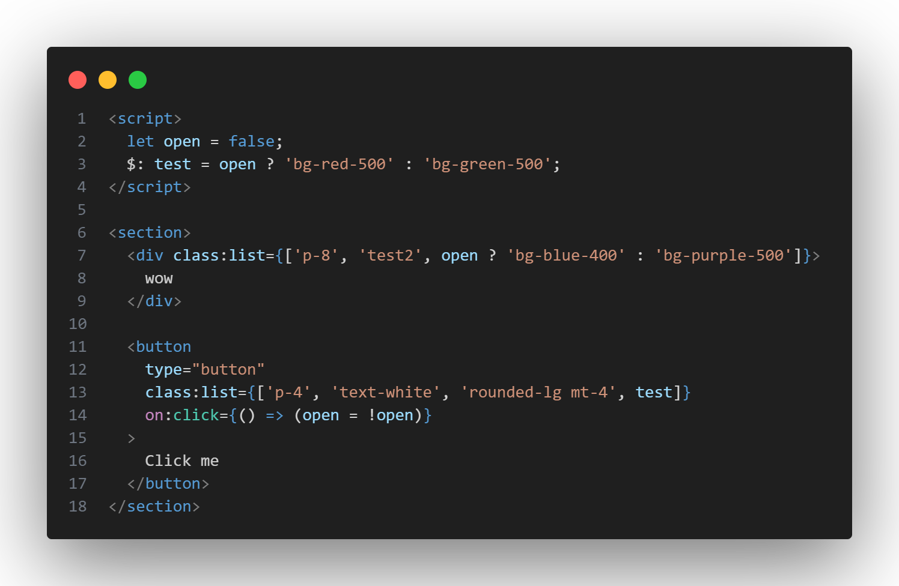

# svelte-classlist-preprocess

`svelte-classlist-preprocess` is a Svelte preprocessor that allows you to use an array inside the `class:list` pattern in your Svelte components.



## Installation

Install the plugin via npm:

```bash
npm install @lostisworld/svelte-classlist-preprocess
```

Install the plugin via pnpm:

```bash
pnpm add @lostisworld/svelte-classlist-preprocess
```

## Usage

To use the `classListPreprocessor` in your Svelte project, import it and add it to your Svelte configuration.

### svelte.config.js

```javascript
import adapter from '@sveltejs/adapter-auto';
import { classListPreprocessor } from '@lostisworld/svelte-classlist-preprocess';

/** @type {import('@sveltejs/kit').Config} */
const config = {
	kit: {
		// adapter-auto only supports some environments, see https://kit.svelte.dev/docs/adapter-auto for a list.
		// If your environment is not supported, or you settled on a specific environment, switch out the adapter.
		// See https://kit.svelte.dev/docs/adapters for more information about adapters.
		adapter: adapter(),
	},
	preprocess: [classListPreprocessor()],
};

export default config;
```

## Preprocessor Details

The `classListPreprocessor` function accepts a single argument pattern, which specifies the attribute to match, typically used with `class:list`. The default pattern is `list`, but you can also define your own pattern by passing it as a `string` to `classListPreprocessor()`.

### Example svelte.config.js

```javascript
import adapter from '@sveltejs/adapter-auto';
import { classListPreprocessor } from '@lostisworld/svelte-classlist-preprocess';

/** @type {import('@sveltejs/kit').Config} */
const config = {
	preprocess: [classListPreprocessor('myPattern')],
	kit: {
		// adapter-auto only supports some environments, see https://kit.svelte.dev/docs/adapter-auto for a list.
		// If your environment is not supported, or you settled on a specific environment, switch out the adapter.
		// See https://kit.svelte.dev/docs/adapters for more information about adapters.
		adapter: adapter(),
	},
};

export default config;
```

### Usage

```svelte
<script>
  let isActive = true;
</script>

<div class:myPattern={['static-class', isActive ? 'active' : 'inactive', 'another-class']}>
  Hello World
</div>
```

## Example

### Input

```svelte
<script>
  let isActive = true;
</script>

<div class:list={['static-class', isActive ? 'active' : 'inactive', 'another-class']}>
  Hello World
</div>
```

### Output

```svelte
<script>
  let isActive = true;
</script>

<div class="static-class {isActive ? 'active' : 'inactive'} another-class">
  Hello World
</div>
```

## Contributing

Contributions are welcome! Please open an issue or submit a pull request on GitHub.

## License

This project is licensed under the MIT License - see the [LICENSE](LICENSE) file for details.
